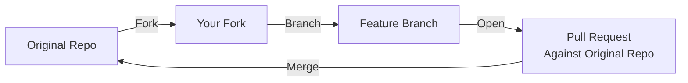

# Contribution Guide

The [GenAI Red Team Initiative](https://github.com/GenAI-Security-Project/GenAI-Red-Team-Initiative) repository is designed to be extensible. We encourage you to contribute new sandboxes or exploitation examples to cover more scenarios and automated Red Teaming tools.

Tools out of the aforementioned scope, such as Red Teaming utils, can be added to the `tools/` directory.


## Start Here!

We follow a standard Open Source Software (OSS) contribution workflow. To contribute, please fork the original repository ([GenAI Red Team Initiative](https://github.com/GenAI-Security-Project/GenAI-Red-Team-Initiative)), create a new branch for your feature or fix, and submit a Pull Request (PR) against the original repository for review.



## Adding New Tutorials and Standalone Code Samples

Tutorials and standalone code samples, not exploiting the sandboxes, may be added to new sudirectories in the `tutorials/` directory.

Be mindful of the importance of providing a clear path for reproducing the results. Code without proper environment configuration files, model requirements, and/or instructions are not acceptable.

Contributors must weigh the value of the content for the audience against the effort of reproducing the results without proper containerization.

## Adding New Exploitation Examples Against Existing Sandboxes

Exploitation examples demonstrate how to attack the sandboxes. You can create manual scripts or integrate automated scanning tools.

### Option A: Manually Crafted Prompts for Jailbreaking and Prompt Injection

If you want to demonstrate a specific attack technique with a list of manually crafted prompts:

1.  **Copy the Template**: Use `exploitation/example` as a starting point to create a new subdirectory under `exploitation/` (e.g., `exploitation/my_attack`).
2.  **Configure the New Prompt List**: Modify `config.toml` to include your list of adversarial prompts under the `[attack]` section.

### Option B: Automated Tools (Garak, Promptfoo, etc.)

If you want to integrate an existing security tool:

1.  **Create a Directory**: Create a new subdirectory under `exploitation/` (e.g., `exploitation/my_tool`).
2.  **Add the Tool**: Add the tool to the directory, following the same structure as `exploitation/garak`, and `exploitation/promptfoo`.

### Option C: Other

You can also create a more customized interaction with the sandbox by adding a new subdirectory under `exploitation/` (e.g., `exploitation/my_tool`) and developing your own logic.


## Adding New Sandboxes

The core logic of a "sandbox" in this handbook is a containerized application that exposes an API (HTTP endpoint) to a shared network. This allows exploitation tools running on the host or in other containers to interact with it.

To add a new sandbox:

1.  **Create a Subdirectory**: Create a new subdirectory under `sandboxes/` (e.g., `sandboxes/name-of-sandbox`).

    Naming convention: `/[GenAI System Type]_[Host]_[Optional Tech Stack Details]`

    Examples: `/llm_local`, `/agentic_local_mcp`.

2.  **Containerize**: Add a `Containerfile` that builds your target application. Ensure it packages all necessary dependencies.
3.  **Expose Ports**: Configure the container to expose the necessary ports (e.g., `8000` for an API, `7860` for Gradio).
4.  **Lifecycle Management**: Add a `Makefile` to simplify common operations. At a minimum, it should include `attack`, `stop`, and `all` recipes.
5.  **Add a README**: Include a `README.md` that documents how to use the sandbox, including any dependencies and setup instructions.

**Example Structure**:

```text
sandboxes/name-of-sandbox/
├── Containerfile       # Definition of the app environment
├── Makefile            # 'make attack', 'make stop', 'make all', etc
└── app/                # Application source code
    └── main.py         # Entry point exposing the API
```
