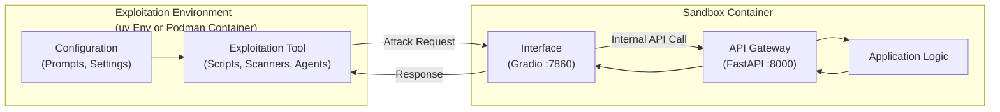

# GenAI Red Team Lab

The [GenAI Red Team Lab](https://github.com/GenAI-Security-Project/GenAI-Red-Team-Lab/) is part of the [OWASP GenAI Security Project](https://github.com/GenAI-Security-Project). It is a branch of the [OWASP GenAI Security Project – Red Teaming Initiative](https://genai.owasp.org/initiatives/#ai-redteaming) and it stands on its own, but it also serves as a companion for the initiative documents, such as the [GenAI Red Teaming Manual](https://genai.owasp.org/initiatives/#ai-redteaming).

This repository provides a collection of sandboxes, exploitation code, and tutorials that exemplifies GenAI Red Teaming exercises. It aims to help security researchers and developers test, probe, and evaluate the safety and security of GenAI-based applications.

This is how we envision the [GenAI Red Team Lab](https://github.com/GenAI-Security-Project/GenAI-Red-Team-Lab/) being used:

* **Sandboxes** may be simply recycled to model the core components of a larger GenAI system.
    
    Alternatively, security researchers and developers may want to adapt a sandbox for their own use case.

* **Exploitation code and tutorials** may serve as learning tools for security researchers and enthusiasts alike.
    
    Additionally, these are easily adaptable for testing out new attacks against sandboxes.

## Contact

- **Code Workstream Leader for the [OWASP GenAI Security Project – Red Teaming Initiative](https://genai.owasp.org/initiatives/#ai-redteaming)**:
    
    _Felipe Campos Penha ([felipe.penha@owasp.org](mailto:felipe.penha@owasp.org))_

## Legacy Repository

The [Legacy Repository](https://github.com/OWASP/www-project-top-10-for-large-language-model-applications/tree/main/initiatives/genai_red_team_handbook) has the history of original contributions by authors _Felipe Campos Penha_ and _Jason Ross_.


## Directory Structure

```text
.
├── CONTRIBUTING.md
├── exploitation
│   ├── AdversarialGenerator
│   ├── agent0
│   ├── example
│   ├── garak
│   ├── Langflow_v1.0.12
│   ├── LangGrinch
│   ├── LocalAI_v2.17.1
│   ├── n8n_RCE_via_file_write
│   ├── Ni8mare
│   └── promptfoo
├── LICENSE
├── README.md
├── sandboxes
│   ├── agentic_local_n8n_v1.65.0
│   ├── llm_local
│   ├── llm_local_InvokeAI_v5.3.0
│   ├── llm_local_langchain_core_v1.2.4
│   ├── llm_local_langflow_v1.0.12
│   ├── llm_local_localAI_v2.17.1
│   ├── mcp_local
│   ├── RAG_local
│   └── README.md
└── tutorials
    ├── community_resources.md
    ├── llm_chatbot_system_prompt_exfiltration.md
    ├── README.md
    └── tools.md
```

## Architecture


```mermaid
graph LR
    subgraph "Exploitation Environment<br/>(uv Env or Podman Container)"
        Tool["Exploitation Tool<br/>(Scripts, Scanners, Agents)"]
        Config["Configuration<br/>(Prompts, Settings)"]
    end

    subgraph "Sandbox Container"
        UI["Interface<br/>(Gradio :7860)"]
        API["API Gateway<br/>(FastAPI :8000)"]
        Logic["Application Logic"]
    end

    Config --> Tool
    Tool -->|Attack Request| UI
    UI -->|Internal API Call| API
    API --> Logic
    Logic --> API
    API --> UI
    UI -->|Response| Tool
```

## System Requirements

This project supports **Linux** and **macOS**. Windows users are encouraged to use WSL2 (Windows Subsystem for Linux).

### Required Tools

*   **[Podman](https://podman.io/)**
*   **[Ollama](https://ollama.com/)**
*   **[Python 3.10+](https://www.python.org/)**
*   **[uv](https://github.com/astral-sh/uv)**
*   **[Make](https://www.gnu.org/software/make/)**

Required for Promptfoo exploitation-only:

*   **[Node.js (v18+)](https://nodejs.org/)**
*   **[npx](https://docs.npmjs.com/cli/v10/commands/npx)**

### Installation Instructions

#### macOS

1.  **Install Dependencies**:
    ```bash
    brew install podman ollama node make
    ```

2.  **Initialize Podman Machine**:
    ```bash
    podman machine init
    podman machine start
    ```

#### Linux (Ubuntu/Debian)

1.  **Install Dependencies**:
    ```bash
    sudo apt-get update
    sudo apt-get install -y podman nodejs npm make
    ```

2.  **Install Ollama**:
    ```bash
    curl -fsSL https://ollama.com/install.sh | sh
    ```

3.  **Install uv**:
    ```bash
    pip install uv
    ```

### Verification

Verify the installation by checking the versions of the installed tools:

```bash
podman version
ollama --version
node --version
make --version
uv --version
```

## Index of Sub-Projects

### `sandboxes/`

*   **[Sandboxes Overview](sandboxes/README.md)**
    *   **Summary**: The central hub for all available sandboxes. It explains the purpose of these isolated environments and lists the available options.

*   **[RAG Local Sandbox](sandboxes/RAG_local/README.md)**
    *   **Summary**: A comprehensive Retrieval-Augmented Generation (RAG) sandbox. It includes a mock Vector Database (Pinecone compatible), mock Object Storage (S3 compatible), and a mock LLM API. Designed for testing vulnerabilities like embedding inversion and data poisoning.
    *   **Sub-guides**:
        *   [Adding New Mock Services](sandboxes/RAG_local/app/mocks/README.md): Guide for extending the sandbox with new API mocks.

*   **[LLM Local Sandbox](sandboxes/llm_local/README.md)**
    *   **Summary**: A lightweight local sandbox that mocks an OpenAI-compatible LLM API using Ollama. Ideal for testing client-side interactions and prompt injection vulnerabilities without external costs.
    *   **Sub-guides**:
        *   [Adding New Mock Services](sandboxes/llm_local/app/mocks/README.md): Guide for extending the sandbox with new API mocks.

*   **[Local MCP Sandbox](sandboxes/mcp_local/README.md)**
    *   **Summary**: A local sandbox environment incorporating the Model Context Protocol (MCP) to simulate tool integrations. It includes a mock API gateway using FastAPI, a mock MCP server, and Ollama integration to test agentic workflows and tool-calling behaviors.

*   **[LangChain Local Sandbox (Vulnerable)](sandboxes/llm_local_langchain_core_v1.2.4/README.md)**
    *   **Summary**: A specialized version of the local sandbox configured with **langchain-core v1.2.4** to demonstrate **CVE-2025-68664** (LangGrinch). It contains an intentional insecure deserialization vulnerability for educational and testing purposes.

*   **[InvokeAI Sandbox (Vulnerable)](sandboxes/llm_local_InvokeAI_v5.3.0/README.md)**
    *   **Summary**: A sandbox environment deploying a vulnerable instance of **InvokeAI v5.3.0**. Designed to practice unauthenticated Remote Code Execution (RCE) via model deserialization attacks (CVE-2024-12029) against GenAI image generation platforms.

*   **[Langflow Sandbox (Vulnerable)](sandboxes/llm_local_langflow_v1.0.12/README.md)**
    *   **Summary**: A sandbox environment deploying a vulnerable instance of **Langflow v1.0.12** for testing unauthenticated Remote Code Execution (RCE) via its custom components backend (CVE-2024-37014).

*   **[LocalAI Sandbox (Vulnerable)](sandboxes/llm_local_localAI_v2.17.1/README.md)**
    *   **Summary**: A sandbox environment deploying a vulnerable instance of **LocalAI v2.17.1** for testing a critical tarslip vulnerability (CVE-2024-6868), which allows arbitrary file writes leading to Remote Code Execution (RCE).

*   **[n8n Vulnerable Sandbox](sandboxes/agentic_local_n8n_v1.65.0/README.md)**
    *   **Summary**: A robust, containerized environment running **n8n v1.65.0**. This version is vulnerable to **four critical CVEs**: **Ni8mare** (CVE-2026-21858), **N8scape** (CVE-2025-68668), **CVE-2025-68613**, and **CVE-2026-21877**. The sandbox is pre-configured with dangerous nodes enabled (`NODES_EXCLUDE=""`) to allow red teamers to practice multiple exploitation techniques (RCE, sandbox escape, file write) safely in isolation.

### `exploitation/`

*   **[Red Team Example](exploitation/example/README.md)**
    *   **Summary**: Demonstrates a red team operation against a local LLM sandbox. It includes an adversarial attack script (`attack.py`) targeting the Gradio interface (port 7860). By targeting the application layer, this approach tests the entire system—including the configurable system prompt—providing a more realistic assessment of the sandbox's security posture compared to testing the raw LLM API in isolation.

*   **[Agent0 Red Team Example](exploitation/agent0/README.md)**
    *   **Summary**: A complete, end‑to‑end, agentic example. [Agent0](https://github.com/agent0ai/agent-zero) orchestrates multiple autonomous agents to attack the sandbox, demonstrating complex, multi-step adversarial workflows. 

        There are options for running it: through the UI (manual prompt interaction) and through the Makefile (programmatic run based on pre-defined prompts).

        The set of pre-defined prompts include prompts for testing vulnerabilities from based on [OWASP Top 10](https://owasp.org/www-community/owasp-top-10), [OWASP Top 10 for LLM Applications](https://owasp.org/www-community/owasp-top-10-for-llm-applications), and [Mitre Atlas Matrix](https://atlas.mitre.org/matrices/ATLAS).

*   **[Garak Scanner Example](exploitation/garak/README.md)**
    *   **Summary**: A comprehensive vulnerability scan using [Garak](https://github.com/NVIDIA/garak). It probes the sandbox for a wide range of weaknesses, including prompt injection, hallucination, and insecure output handling, mapping results to the OWASP Top 10.

*   **[Promptfoo Scanner Example](exploitation/promptfoo/README.md)**
    *   **Summary**: A powerful red teaming setup using [Promptfoo](https://www.promptfoo.dev/). It runs automated probes to identify vulnerabilities such as PII leakage and prompt injection, providing detailed reports and regression testing capabilities.

*   **[Langflow Exploitation](exploitation/Langflow_v1.0.12/README.md)**
    *   **Summary**: Details the discovery and exploitation of **CVE-2024-37014** (RCE via Custom Component) in the Langflow sandbox, demonstrating how an attacker can execute arbitrary system commands or establish a reverse shell.

*   **[LangGrinch Exploitation](exploitation/LangGrinch/README.md)**
    *   **Summary**: A dedicated exploitation module for **CVE-2025-68664** in the LangChain sandbox. It demonstrates how to use prompt injection to force the LLM into generating a malicious JSON payload, which is then insecurely deserialized by the application to leak environment secrets.

*   **[LocalAI Tarslip Exploitation](exploitation/LocalAI_v2.17.1/README.md)**
    *   **Summary**: Demonstrates how to exploit **CVE-2024-6868** (Tarslip) in the LocalAI sandbox. The exploit uses a custom Python script to upload a malicious tar file that writes files to arbitrary locations, leading to Remote Code Execution (RCE) by overwriting backend assets.

*   **[Ni8mare Exploitation](exploitation/Ni8mare/README.md)**
    *   **Summary**: A demonstration of **CVE-2026-21858** (Ni8mare) against the n8n sandbox. It uses a custom Python script to simulate the critical "Unauthenticated Arbitrary File Read" vulnerability, extracting the SQLite database and dumping administrator credentials (hashed passwords) to prove full system compromise.

*   **[n8n RCE via File Write Exploitation](exploitation/n8n_RCE_via_file_write/README.md)**
    *   **Summary**: A complete, end-to-end Python exploitation script for **CVE-2026-21877** targeting the vulnerable n8n sandbox. It demonstrates workflow injection to exploit the unrestricted `Execute Command` node.

*   **[Adversarial Prompt Generator](exploitation/AdversarialGenerator/README.md)**
    *   **Summary**: An automated system for generating diverse, category-specific jailbreak and prompt-injection payloads, and executing them against a local LLM sandbox. Uses `attack.py` to run attacks and generates detailed Markdown reports of the results.

### `tutorials/`

*   **[Community Resources for Agentic AI Red Teaming](tutorials/community_resources.md)**
    * **Summary**: A curated, professional list of community resources to help practitioners plan, execute, and improve agentic AI red teaming efforts.

*   **[Tools](tutorials/tools.md)**
    * **Summary**: A curated list of tools, organized by the phases defined in the [GenAI Red Teaming Manual](https://genai.owasp.org/initiatives/#ai-redteaming).

*   **[LLM Chatbot System Prompt Exfiltration](tutorials/llm_chatbot_system_prompt_exfiltration.md)**
    * **Summary**: A comprehensive tutorial outlining a five-stage attack chain (from passive reconnaissance to API-layer system role injection) targeting LLM-powered chatbots to exfiltrate their system prompt, including remediation steps.


## Contribution Guide

Please refer to [CONTRIBUTING.md](CONTRIBUTING.md) for instructions on how to add new sandboxes and exploitation examples.