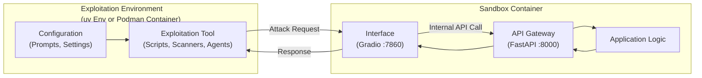

# GenAI Red Team Handbook

This handbook provides a collection of resources, sandboxes, and examples designed to facilitate Red Teaming exercises for Generative AI systems. It aims to help security researchers and developers test, probe, and evaluate the safety and security of LLM applications.

## Directory Structure

```text
initiatives/genai_red_team_handbook
├── exploitation
│   ├── agent0
│   ├── example
│   ├── garak
│   ├── LangGrinch
│   ├── Ni8mare
│   └── promptfoo
└── sandboxes
    ├── RAG_local
    ├── agentic_local_n8n_v1.120.0
    ├── llm_local
    └── llm_local_langchain_core_v1.2.4
```

## Architecture



## System Requirements

This project supports **Linux** and **macOS**. Windows users are encouraged to use WSL2 (Windows Subsystem for Linux).

### Required Tools

*   **[Podman](https://podman.io/)**
*   **[Ollama](https://ollama.com/)**
*   **[Python 3.10+](https://www.python.org/)**
*   **[uv](https://github.com/astral-sh/uv)**
*   **[Make](https://www.gnu.org/software/make/)**

Required for Promptfoo:

*   **[Node.js (v18+)](https://nodejs.org/)**
*   **[npx](https://docs.npmjs.com/cli/v10/commands/npx)**

### Installation Instructions

#### macOS

1.  **Install Dependencies**:
    ```bash
    brew install podman ollama node make
    ```

2.  **Initialize Podman Machine**:
    ```bash
    podman machine init
    podman machine start
    ```

#### Linux (Ubuntu/Debian)

1.  **Install Dependencies**:
    ```bash
    sudo apt-get update
    sudo apt-get install -y podman nodejs npm make
    ```

2.  **Install Ollama**:
    ```bash
    curl -fsSL https://ollama.com/install.sh | sh
    ```

3.  **Install uv**:
    ```bash
    pip install uv
    ```

### Verification

Verify the installation by checking the versions of the installed tools:

```bash
podman version
ollama --version
node --version
make --version
uv --version
```

## Index of Sub-Projects

### `sandboxes/`

*   **[Sandboxes Overview](sandboxes/README.md)**
    *   **Summary**: The central hub for all available sandboxes. It explains the purpose of these isolated environments and lists the available options.

*   **[RAG Local Sandbox](sandboxes/RAG_local/README.md)**
    *   **Summary**: A comprehensive Retrieval-Augmented Generation (RAG) sandbox. It includes a mock Vector Database (Pinecone compatible), mock Object Storage (S3 compatible), and a mock LLM API. Designed for testing vulnerabilities like embedding inversion and data poisoning.
    *   **Sub-guides**:
        *   [Adding New Mock Services](sandboxes/RAG_local/app/mocks/README.md): Guide for extending the sandbox with new API mocks.

*   **[LLM Local Sandbox](sandboxes/llm_local/README.md)**
    *   **Summary**: A lightweight local sandbox that mocks an OpenAI-compatible LLM API using Ollama. Ideal for testing client-side interactions and prompt injection vulnerabilities without external costs.
    *   **Sub-guides**:
        *   [Adding New Mock Services](sandboxes/llm_local/app/mocks/README.md): Guide for extending the sandbox with new API mocks.

*   **[LangChain Local Sandbox (Vulnerable)](sandboxes/llm_local_langchain_core_v1.2.4/README.md)**
    *   **Summary**: A specialized version of the local sandbox configured with **langchain-core v1.2.4** to demonstrate **CVE-2025-68664** (LangGrinch). It contains an intentional insecure deserialization vulnerability for educational and testing purposes.

*   **[n8n Vulnerable Sandbox](sandboxes/agentic_local_n8n_v1.120.0/README.md)**
    *   **Summary**: A robust, containerized environment running **n8n v1.120.0**. This version is vulnerable to **four critical CVEs**: **Ni8mare** (CVE-2026-21858), **N8scape** (CVE-2025-68668), **CVE-2025-68613**, and **CVE-2026-21877**. The sandbox is pre-configured with dangerous nodes enabled (`NODES_EXCLUDE=""`) to allow red teamers to practice multiple exploitation techniques (RCE, sandbox escape, file write) safely in isolation.


### `exploitation/`

*   **[Red Team Example](exploitation/example/README.md)**
    *   **Summary**: Demonstrates a red team operation against a local LLM sandbox. It includes an adversarial attack script (`attack.py`) targeting the Gradio interface (port 7860). By targeting the application layer, this approach tests the entire system—including the configurable system prompt—providing a more realistic assessment of the sandbox's security posture compared to testing the raw LLM API in isolation.

*   **[Agent0 Red Team Example](exploitation/agent0/README.md)**
    *   **Summary**: A complete, end‑to‑end, agentic example. [Agent0](https://github.com/agent0ai/agent-zero) orchestrates multiple autonomous agents to attack the sandbox, demonstrating complex, multi-step adversarial workflows. 

        There are options for running it: through the UI (manual prompt interaction) and through the Makefile (programmatic run based on pre-defined prompts).

        The set of pre-defined prompts include prompts for testing vulnerabilities from based on [OWASP Top 10](https://owasp.org/www-community/owasp-top-10), [OWASP Top 10 for LLM Applications](https://owasp.org/www-community/owasp-top-10-for-llm-applications), and [Mitre Atlas Matrix](https://atlas.mitre.org/matrices/ATLAS).

*   **[Garak Scanner Example](exploitation/garak/README.md)**
    *   **Summary**: A comprehensive vulnerability scan using [Garak](https://github.com/NVIDIA/garak). It probes the sandbox for a wide range of weaknesses, including prompt injection, hallucination, and insecure output handling, mapping results to the OWASP Top 10.

*   **[Promptfoo Scanner Example](exploitation/promptfoo/README.md)**
    *   **Summary**: A powerful red teaming setup using [Promptfoo](https://www.promptfoo.dev/). It runs automated probes to identify vulnerabilities such as PII leakage and prompt injection, providing detailed reports and regression testing capabilities.

*   **[LangGrinch Exploitation](exploitation/LangGrinch/README.md)**
    *   **Summary**: A dedicated exploitation module for **CVE-2025-68664** in the LangChain sandbox. It demonstrates how to use prompt injection to force the LLM into generating a malicious JSON payload, which is then insecurely deserialized by the application to leak environment secrets.

*   **[n8n RCE via File Write Exploitation](exploitation/n8n_RCE_via_file_write/README.md)**
    *   **Summary**: A complete, end-to-end Python exploitation script for **CVE-2026-21877** targeting the vulnerable n8n sandbox. It demonstrates workflow injection to exploit the unrestricted `Execute Command` node.


## Contribution Guide

Please refer to [CONTRIBUTING.md](CONTRIBUTING.md) for instructions on how to add new sandboxes and exploitation examples.