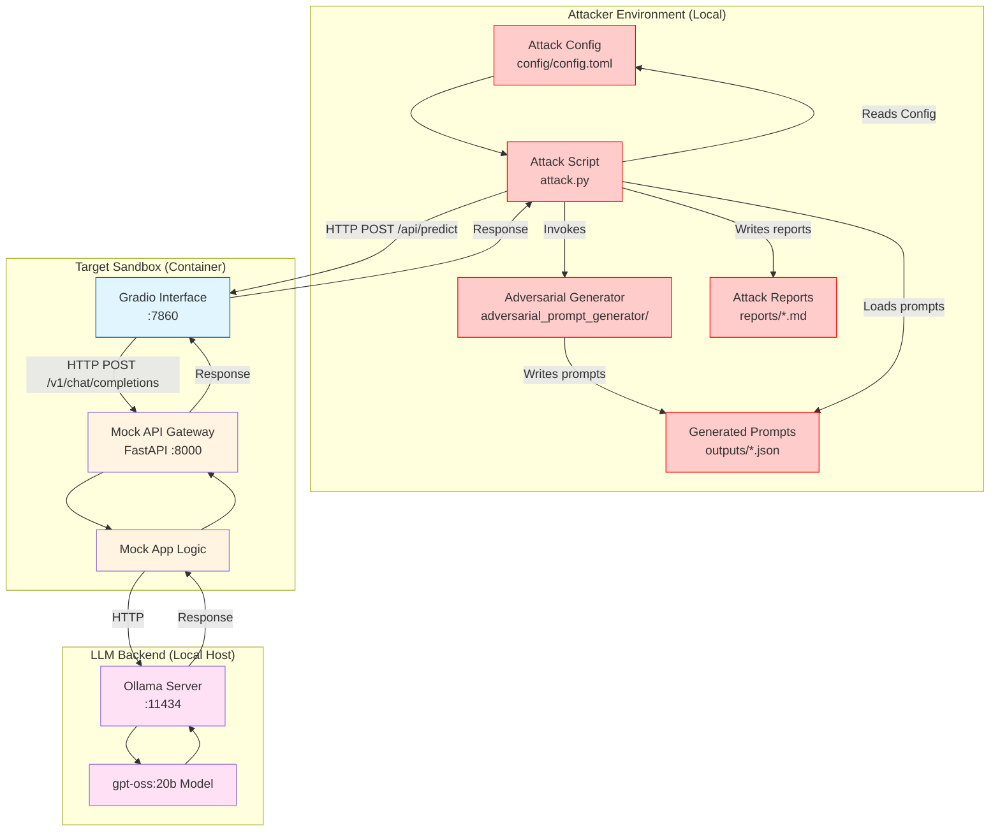

# Adversarial Prompt Generator: Automated Red Teaming on LLM Sandbox

This directory contains an automated system design and implementation for generating diverse, category-specific jailbreak and prompt-injection payloads, and executing them against a local LLM sandbox.

The setup uses a Python script (`attack.py`) to generate adversarial prompts, write them to a JSON file, load them back, and send them to the `llm_local` sandbox via its Gradio interface (port 7860) to test safety guardrails.

> [!WARNING]
> **Testing Precaution:** Always keep the number of prompts small (e.g., `num_prompts = 3` or `5` in `config/config.toml`) for testing purposes. Generating and running a large number of prompts can result in extremely long execution times and resource exhaustion on the sandbox container.

---

## 📋 Table of Contents

1. [Attack Strategy](#attack-strategy)
2. [Prerequisites](#prerequisites)
3. [Running the Sandbox](#running-the-sandbox)
4. [Configuration](#configuration)
5. [Files Overview](#files-overview)
6. [OWASP Top 10 Coverage](#owasp-top-10-coverage)

---

## Attack Strategy



## 🔧 Prerequisites

- **Podman** (or Docker) – container runtime for the sandbox.
- **Make** – for running automation commands.
- **uv** – for Python package dependency management.

---

## 🚀 Running the Sandbox

The `Makefile` abstracts the container setup and python commands.

| Target | What it does | Typical usage |
|--------|--------------|---------------|
| `make setup` | Builds and starts the local LLM sandbox container. | `make setup` |
| `make attack` | Generates adversarial prompts and runs the attack (`attack.py`). | `make attack` |
| `make stop` | Stops and removes the sandbox container. | `make stop` |
| `make all` | Runs `stop → setup → attack → stop` in one shot. | `make all` |

---

## ⚙️ Configuration

### `config/config.toml`

The configuration file defines the target environment and generation options:

```toml
[target]
sandbox = "llm_local"

[attack]
# Attack category to generate prompts for
category = "system_prompt_exfiltration"

# WARNING: Keep the number of prompts small (e.g. <= 100) for testing
num_prompts = 100

# Format: json or jsonl
output_format = "json"
output_dir = "outputs"
no_diversity_filter = false
```

> [!NOTE]
> **Prompt Count & Diversity Filtering:**
> By default, `no_diversity_filter = false`. When active, a semantic similarity filter removes duplicates and highly similar prompts. 
> 
> Consequently, the number of prompts written and tested against the sandbox will be lower than `num_prompts`. For example, generating `num_prompts = 100` might result in only 44 highly distinct prompts being retained and executed. To disable this filter and send all raw candidate prompts, set `no_diversity_filter = true`.

---

## Files Overview

- **`attack.py`**: The script that generates the payload, saves it to a JSON file, reads it back, and executes the attack.
- **`config/config.toml`**: Configuration parameters for the attack run.
- **`Makefile`**: Commands for setup, running attacks, formatting, and teardown.
- **`adversarial_prompt_generator/`**: The core package containing the generator implementation, templates, categories, and diversity filter logic.
- **`reports/`**: Directory containing the generated Markdown reports (`log_*.md`) of the attacks showing details of the prompt injections and responses.

---

## OWASP Top 10 Coverage

This simulation tests LLM safeguards against:

| OWASP Top 10 Vulnerability | Description |
| :--- | :--- |
| **LLM01: Prompt Injection** | Testing if generated adversarial prompts can override LLM system instructions or exfiltrate private prompt context. |
