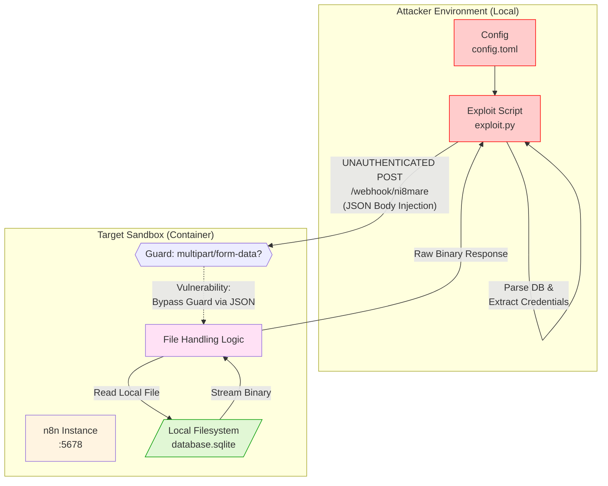

# Red Team Example:
# Ni8mare (CVE-2026-21858) - n8n Unauthenticated Arbitrary File Read

This directory contains a **complete, end-to-end** example of exploiting the **Ni8mare** vulnerability in n8n.

The setup uses separate scripts to demonstrate the [**CVE-2026-21858**](https://nvd.nist.gov/vuln/detail/CVE-2026-21858) vulnerability. According to NVD and security research, n8n versions from **v1.65.0 up to (but not including) v1.121.0** are vulnerable to this unauthenticated arbitrary file read.

By exploiting a Content-Type confusion flaw in the Webhook node, an attacker can trick n8n into reading arbitrary files from the server's local filesystem—including the main SQLite database—and extracting administrative credentials without ever logging in.

> [!NOTE]
> While versions like **v1.120.0** are technically patched against the simple RCE variant, they remain vulnerable to the arbitrary file read if the Content-Type check is bypassed. However, newer versions (v1.120+) also introduce a destructive `rm` call that deletes the file after reading, effectively neutralizing any persistence or repeated reads on critical system files. This sandbox defaults to **v1.65.0** for a stable and safe demonstration.

---

## 📋 Table of Contents

1. [Attack Strategy](#attack-strategy)
2. [Technical Concepts: Agents & Tools](#technical-concepts-agents--tools)
3. [Prerequisites](#prerequisites)
4. [Running the Exploit](#running-the-exploit)
5. [Configuration](#configuration)
6. [Files Overview](#files-overview)
7. [How it Works (Step-by-Step)](#how-it-works-step-by-step)
8. [References](#references)

---

## Attack Strategy

The exploit leverages a **Content-Type Confusion** vulnerability in n8n's webhook handling. By sending a crafted JSON payload to an active webhook endpoint, an attacker can inject a `files` object into the request body. Because the system fails to verify the content type before processing the body, n8n treats the user-supplied `filepath` as a locally uploaded file, allowing the attacker to "copy" any file from the server into the workflow's data stream.

### Detailed Attack Flow



1.  **Exploit (Unauthenticated)**: The attacker hits a production webhook URL with a specific JSON payload. No authentication headers or session cookies are used.
2.  **Data Extraction**: The system processes the injected `files` object, reads the requested file (e.g., `database.sqlite`), and returns it as a binary stream.
3.  **Credential Dumping**: The exploit script parses the database locally to extract administrative users and their Bcrypt password hashes.

---

## 🧠 Technical Concepts: Agents & Tools

This exploit demonstrates how platform-level vulnerabilities affect the underlying infrastructure of automation and AI platforms.

### 1. Agents
*   **The Impact:** This attack targets the platform *hosting* the agents. Compromising the n8n database gives an attacker full control over every agent, API key, and credential managed by that instance.

### 2. Tools
*   **The Exploit:** The vulnerability effectively turns the `Webhook` node's internal file-handling utility into an unintended "file-reading tool" for an unauthenticated attacker.

---

## 🔧 Prerequisites

- **Podman** (or Docker) – container runtime.
- **Make** – for automation.
- **uv** – for dependency management.

---

## 🚀 Running the Exploit

We separate **Sandbox Preparation** from the **Actual Exploit** to clearly prove the unauthenticated nature of the vulnerability.

| Target | What it does | Auth Required? |
|--------|--------------|----------------|
| `make setup` | Starts the sandbox and creates a "target" webhook workflow. | **YES** (Preparation) |
| `make attack` | Runs `exploit.py` which performs the unauthenticated extraction. | **NO** (Exploitation) |
| `make all` | Runs `stop → setup → attack → stop` sequence. | - |

### Verify Unauthenticated Nature
To prove no credentials are used, you can run the attack in two separate terminals or ensure no session state exists:
```bash
# Terminal 1: Setup the target
make setup

# Terminal 2: Perform the attack (Purely Unauthenticated)
make attack
```

---

## ⚙️ Configuration

### `config.toml`

```toml
[attack]
target_url = "http://localhost:5678"
target_file = "/home/node/.n8n/database.sqlite"
email = "admin@target.com"
password = "AdminPassword123!"
```

- **`target_file`**: The absolute path of the file you wish to extract.
- **`email`/`password`**: Credentials used *only* by `setup_target.py` to prepare the environment. `exploit.py` ignores these.

---

## Files Overview

- **`exploit.py`**: The **unauthenticated** exploit implementation.
- **`setup_target.py`**: Authenticated script to prepare the vulnerable sandbox.
- **`config.toml`**: Target settings and setup credentials.
- **`Makefile`**: Automation scripts.

---

## How it Works (Step-by-Step)

### 1. The Injection Attack (`exploit.py`)
*   Sends a POST request to the webhook endpoint (e.g., `/webhook/ni8mare`).
*   **Payload**: A JSON body containing a `files` object.
*   **Vulnerability**: The vulnerable n8n version processes `req.body.files` even for `application/json` requests, treating the string path as a legitimate "successfully uploaded" file reference.

### 2. Data Retrieval & Extraction
*   The n8n `Webhook` node handles the request and "reflects" the file specified in the `filepath` through the next node.
*   `exploit.py` receives the raw binary data.
*   It saves the data as a temporary SQLite database and queries the `user` table to dump credentials.

### Execution Output

```text
[*] Launching UNAUTHENTICATED exploit against http://localhost:5678...
[!] Sending malicious JSON to http://localhost:5678/webhook/ni8mare...
[+] File extracted successfully to: /var/folders/t0/k8gt3srs7xqd5cppy9549_pc0000gn/T/tmp849ats0d.sqlite

[*] Analyzing database: /var/folders/t0/k8gt3srs7xqd5cppy9549_pc0000gn/T/tmp849ats0d.sqlite
============================================================
User ID:    d96eea4a-4bec-4895-b241-e22a3c042e4c
Email:      admin@target.com
Role:       global:owner
Hash:       $2a$10$5VQMcEpamqisBn4qyijF4.3wv1jXprG4dVKKwILxFh.lEqmydLQle
============================================================
[*] Cleaned up: /var/folders/t0/k8gt3srs7xqd5cppy9549_pc0000gn/T/tmp849ats0d.sqlite

[SUCCESS] Unauthenticated exploitation complete!
Exploitation Demo - Completed!
```

---

## References

- [Ni8mare: Unauthenticated Remote Code Execution in n8n (CVE-2026-21858)](https://nvd.nist.gov/vuln/detail/CVE-2026-21858)
- [Picus Security: Ni8mare Exploit Analysis](https://www.picussecurity.com/resource/blog/cve-2026-21858-ni8mare-exploit)
- [Miggo: CVE-2026-21858 Explained](https://miggo.io/n8n-unauthenticated-rce/)
