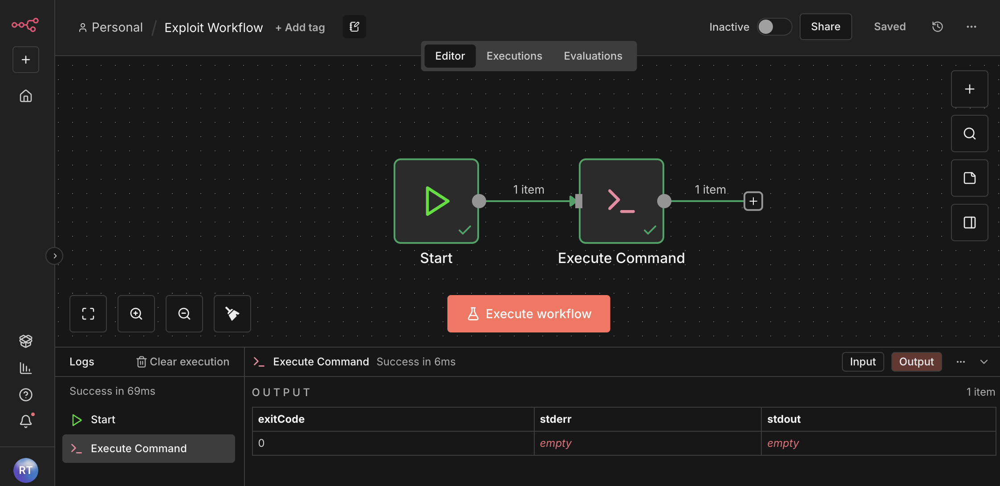
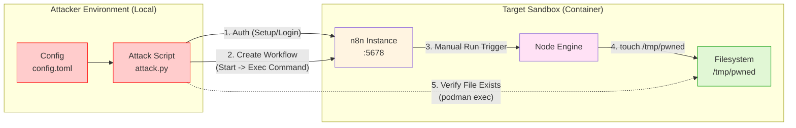

# Red Team Example:
# n8n Remote Code Execution via File Write

This directory contains a **complete, end-to-end** example of exploiting a local vulnerable **n8n** instance.

The setup uses a Python script (`attack.py`) to authenticate against the `agentic_local_n8n_v1.120.0` sandbox and write a file to the system (e.g., an executable), via workflow injection. Although our demonstration stops at this step, the written file could, later, be leveraged by the attacker to execute malicious code, demonstrating the [**CVE-2026-21877**](https://nvd.nist.gov/vuln/detail/CVE-2026-21877) vulnerability impact.

---

## 📋 Table of Contents

1. [Attack Strategy](#attack-strategy)
2. [Prerequisites](#prerequisites)
3. [Running the Exploit](#running-the-exploit)
4. [Configuration](#configuration)
5. [Files Overview](#files-overview)
6. [References](#references)

---

## Attack Strategy

The exploit leverages the unsecured `Execute Command` node in an authenticated workflow to achieve Remote Code Execution (RCE). Verification is performed by checking for a specific file created by the payload.

Workflow diagram as seen in the n8n interface:

<p align="center">
  
</p>


Detailed workflow diagram, with the local components of the attack:



## 🧠 Technical Concepts: Agents & Tools

A common question when analyzing this exploit is how it relates to modern AI concepts like Agents, Tools, and the Model Context Protocol (MCP).

### 1. Agents
*   **In this script:** There are no AI agents. The script follows a fixed, linear logic: `Read Config` -> `Register/Login` -> `Create Workflow` -> `Run Workflow` -> `Verify Success`.
*   **The Target:** `n8n` is a platform often used to *build* AI agents, but this attack targets the platform itself (specifically its ability to run shell commands), not an AI agent logic.

### 2. Tools
*   **In this script:** The term "Tool" applies here in the context of **n8n Nodes**. The script creates a workflow that utilizes the **"Execute Command"** node (represented as `n8n-nodes-base.executeCommand` in the JSON payload).
*   **The Exploit:** The script effectively uses the `Execute Command` node as a "tool" to run arbitrary shell commands on the server.

### 3. MCP (Model Context Protocol)
*   **In this script:** There is no usage of MCP. The script communicates using standard **JSON over HTTP** (REST API) to the `n8n` backend (`http://localhost:5678`).

---

## 🔧 Prerequisites

- **Podman** (or Docker) – container runtime.
- **Make** – for automation.
- **uv** – for dependency management.

---

## 🚀 Running the Exploit

The `Makefile` abstracts the setup and attack process.

| Target | What it does | Typical usage |
|--------|--------------|---------------|
| `make setup` | Builds and starts the vulnerable n8n container. | `make setup` |
| `make attack` | Runs the exploitation script. | `make attack` |
| `make stop` | Stops and removes the sandbox. | `make stop` |
| `make all` | Runs `stop → setup → attack → stop` sequence. | `make all` |

---

## ⚙️ Configuration

### `config.toml`

Controls the attack parameters:

```toml
[attack]
email = "redteam@example.com"
password = "RedTeamPassword123!"
command = "touch /tmp/pwned"
```

- **`command`**: The shell command to execute on the target server. The script currently defaults to `touch /tmp/pwned` for robust side-effect verification.

---

## Files Overview

- **`attack.py`**: Python script that automates authentication, workflow creation, and side-effect verification.
- **`config.toml`**: Configuration for authentication and payload.
- **`Makefile`**: Automation commands.

## How `attack.py` Works (Step-by-Step)

1. **Authentication**
    *   The script acts like a web browser (`requests.Session`).
    *   It attempts to register a new owner account at `POST /rest/owner/setup`. This is often allowed on fresh instances or improperly secured ones.
    *   If already registered, it falls back to logging in (`POST /rest/login`) using credentials from `config.toml`.
    *   **Goal**: Obtain the `n8n-auth` cookie to authorize API requests.

2. **Workflow Construction**
    *   It constructs a JSON payload representing an n8n workflow.
    *   **Node 1**: Start (Triggers the flow).
    *   **Node 2**: Execute Command (Runs the shell command from your config file).
    *   **Connection**: Connects Start output to Execute Command input.

3. **Deploy & Execute**
    *   It sends the workflow to `POST /rest/workflows` to save it on the server.
    *   It manually triggers the workflow via `POST /rest/workflows/{id}/run`.

4. **Verification**
    *   It uses `subprocess` to call `podman` on your local machine.
    *   It checks if the file `/tmp/pwned` exists inside the `n8n_vuln_container`.
    *   If the file exists, it confirms that the command running inside the n8n workflow successfully executed on the underlying system.

---

## References

- [NVD - CVE-2026-21877](https://nvd.nist.gov/vuln/detail/CVE-2026-21877)
- [n8n Warns of CVSS 10.0 RCE](https://thehackernews.com/2026/01/n8n-warns-of-cvss-100-rce-vulnerability.html)