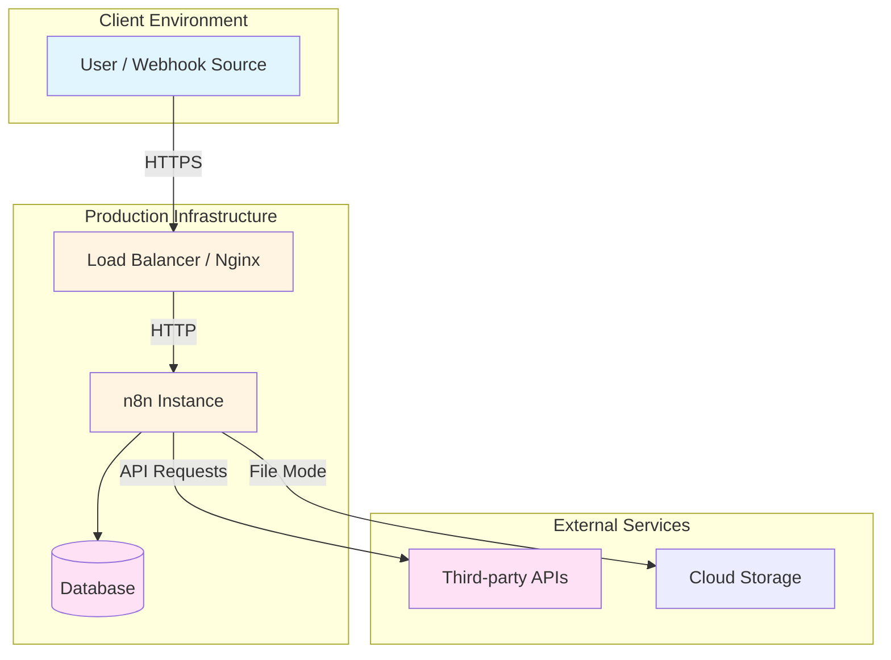
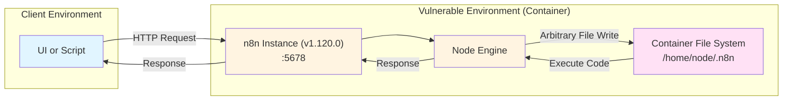

# n8n Vulnerable Sandbox (Ni8mare & Others)

## Overview
This repository provides a robust **template for creating a local, vulnerable n8n sandbox**. It is designed for Red Teaming, allowing you to study and reproduce **Ni8mare (CVE-2026-21858)** and other critical vulnerabilities in a safe, isolated container.

## Using as a Sandbox Template
This project serves as a "Vulnerable n8n Instance". It runs a specific version of n8n that contains a critical security flaw, configured to be exploitable for educational and testing purposes.

**Why use this for Red Teaming?**
- **Controlled Environment**: Test attacks and defenses in a safe, isolated container without risking production systems.
- **Reproducibility**: Guarantee the exact version (1.120.0) and configuration needed to trigger the vulnerability.
- **Offline Capable**: Work in air-gapped or restricted network environments.
- **Zero Risk**: Isolate RCE payloads within a disposable container volume.

The template includes the vulnerable application, automated setup using **Make**, and container orchestration using **Podman**.

## Architecture

### Production Deployment (Target Architecture)
In a real-world scenario, n8n is often deployed behind a load balancer or reverse proxy, processing webhooks and user interactions that trigger workflows.



### Local Sandbox Setup (This Template)
This sandbox simplifies the architecture to focus purely on the vulnerability, exposing the n8n instance directly to the host machine.



## Vulnerabilities

n8n has disclosed **four critical vulnerabilities**, in January 2026, that affect the n8n instance running in this sandbox (version 1.120.0):

| ID | Title | Nickname | Description |
| :--- | :--- | :--- | :--- |
| [**CVE-2025-68613**](https://nvd.nist.gov/vuln/detail/CVE-2025-68613) | Remote Code Execution via Dynamic Code Resources | - | A flaw in the handling of dynamic code resources that permits authenticated users to achieve remote code execution (RCE). |
| [**CVE-2025-68668**](https://nvd.nist.gov/vuln/detail/CVE-2025-68668) | Sandbox Escape via Workflow Manipulation | **N8scape** | Allows authenticated users with workflow privileges to bypass the sandbox and execute arbitrary commands on the host system. |
| [**CVE-2026-21877**](https://nvd.nist.gov/vuln/detail/CVE-2026-21877) | Unrestricted File Upload leading to RCE | - | An unrestricted file upload vulnerability that enables authenticated attackers to execute malicious code and compromise the instance. |
| [**CVE-2026-21858**](https://nvd.nist.gov/vuln/detail/CVE-2026-21858) | Unauthenticated RCE via Form-based Workflows | **Ni8mare** | A critical unauthenticated RCE where attackers leverage form-based workflows to access server files and gain full control. |

## Prerequisites
- **Podman** (or Docker – replace `podman` with `docker` in the Makefile if desired)
- **Make** (for running automation commands)

## Configuration

### Vulnerability Configuration

The sandbox is configured via `Makefile` environment variables to ensure exploitability across the different CVEs.

**Note:** If these variables are not explicitly set in your environment, the `Makefile` ensures they are passed to the container at runtime.

#### 1. `NODES_EXCLUDE=""`
*   **Effect:** Explicitly **enables all nodes**, including dangerous ones like `Execute Command` and `Read/Write Files` that might otherwise be restricted.
*   **Relevance to CVEs:**
    *   **CVE-2025-68668 (N8scape):** Directly facilitates this by ensuring the `Code` node and others are available to attempt sandbox escapes.
    *   **CVE-2026-21877:** Ensures nodes required for post-exploitation (like file writing or command execution) are available once access is gained.
    *   **CVE-2026-21858 (Ni8mare):** While this is an auth bypass/form issue, having all nodes enabled ensures that any malicious workflow payload can execute without restriction.

#### 2. `N8N_HOST=0.0.0.0`
*   **Effect:** Exposes the service to the entire network (binding to all interfaces).
*   **Relevance to CVEs:**
    *   **All CVEs:** Increases the attack surface by making the instance reachable from external networks (or the host), simulating a misconfigured production deployment.

#### 3. `WEBHOOK_URL=http://localhost:5678/`
*   **Effect:** Sets the base URL for webhooks.
*   **Relevance to CVEs:**
    *   **CVE-2026-21858 (Ni8mare):** This exploit relies on form-based triggers. Correct webhook URL configuration ensures that the form URLs generated by n8n are reachable and valid for the attacker to query.

### Data Persistence
- **Volume**: `./data` is mounted to `/home/node/.n8n` to persist workflows and credentials between restarts.

## Quick Start

```bash
# View all available commands
make help

# Full setup and launch
make n8n
```

The vulnerable n8n interface will be available at `http://localhost:5678`.

## Available Commands

Run `make help` to see all commands:

**Main:**
- `make n8n` - Full setup: clean, build, and start n8n.

**Container Operations:**
- `make build` - Build the container image.
- `make up` - Run the container.
- `make down` - Stop and remove the container.
- `make clean` - Clean up containers, images, and networks.
- `make logs` - Follow container logs.

## Testing the Vulnerability

1.  **Start the Sandbox**: `make n8n`
2.  **Access UI**: Visit `http://localhost:5678`.
3.  **Setup**: You may need to create an owner account on first launch.
4.  **Exploit attempt**:
    -   Create a workflow.
    -   Add an "Execute Command" node (enabled by our config).
    -   Or attempt the specific Arbitrary File Write payload associated with CVE-2026-21877.

## Project Structure
```
.
├── data/                     # Persisted n8n data (workflows, credentials)
├── Containerfile            # Podman container definition
├── Makefile                 # Developer and automation commands
└── README.md                # This file
```

## Troubleshooting

**Port conflicts:**
- If port 5678 is in use: `make clean` to remove old containers or check other running services.

**Container issues:**
- View logs: `make logs`
- Restart: `make down && make up`
- Full cleanup: `make clean && make build && make up`

## References
- [Critical n8n Vulnerability (CVSS 10.0)](https://thehackernews.com/2026/01/critical-n8n-vulnerability-cvss-100.html)
- [Critical n8n Flaw (CVSS 9.9)](https://thehackernews.com/2025/12/critical-n8n-flaw-cvss-99-enables.html)
- [New n8n Vulnerability (9.9 CVSS)](https://thehackernews.com/2026/01/new-n8n-vulnerability-99-cvss-lets.html)
- [n8n Warns of CVSS 10.0 RCE](https://thehackernews.com/2026/01/n8n-warns-of-cvss-100-rce-vulnerability.html)
- [NVD - CVE-2026-21858](https://nvd.nist.gov/vuln/detail/CVE-2026-21858)
- [NVD - CVE-2025-68613](https://nvd.nist.gov/vuln/detail/CVE-2025-68613)
- [NVD - CVE-2025-68668](https://nvd.nist.gov/vuln/detail/CVE-2025-68668)
- [NVD - CVE-2026-21877](https://nvd.nist.gov/vuln/detail/CVE-2026-21877)
